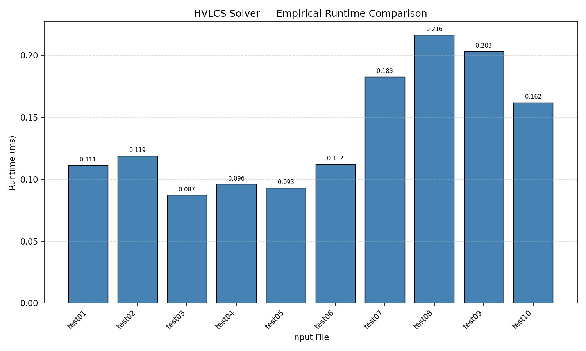

# COP4533 Programming Assignment 3 — HVLCS

## Students

| Name | UFID |
|------|------|
| Taebok Joseph Kim | 13744367 |
| Manas Adepu | 67807126 |

## How to Build / Compile

No compilation is needed. The program is written in Python 3 and can be run directly.

The only external dependency is `matplotlib`, which is used to generate the runtime graph. Install it with:
```
pip install matplotlib
```

## How to Run

### Run the solver on a single input file
```
python src/hvlcs.py <input_file>
```

**Example:**
```
python src/hvlcs.py data/example.in
```
Expected output:
```
9
cb
```

### Run all test cases and generate the runtime graph
```
python src/benchmark.py
```
This runs the solver on every test file in `data/`, prints the timing results, and saves the runtime graph to `data/runtime_graph.png`.

### Example input files
- `data/example.in` / `data/example.out` — the worked example from the assignment
- `data/test01.in` through `data/test10.in` — nontrivial test cases with strings of length at least 25

## Assumptions

- Input files use the following format:
  ```
  k
  char1 value1
  char2 value2
  ...
  A
  B
  ```
  where `k` is the number of distinct characters with assigned values, followed by `k` lines each containing a character and its integer value, then string `A` and string `B` on separate lines.
- All character values are positive integers.
- Strings `A` and `B` only contain lowercase letters.
- Any character that appears in `A` or `B` but is not listed in the value table is treated as having a value of 0.

## Written Component (Questions 1–3)

## Question 1: Empirical Comparison

We ran the HVLCS solver on 10 nontrivial input files, each containing strings of length at least 25. The graph below shows the measured runtime for each file.



## Question 2: Recurrence Equation

Let `dp[i][j]` be the maximum value of any common subsequence of `A[1..i]` and `B[1..j]`, and let `val(c)` denote the value of character `c`.

**Base cases:**
```
dp[0][j] = 0   for all j = 0..n
dp[i][0] = 0   for all i = 0..m
```
When either string is empty there is no common subsequence, so the maximum value is 0.

**Recurrence:**
```
           dp[i-1][j-1] + val(A[i])        if A[i] == B[j]
dp[i][j] =
           max(dp[i-1][j], dp[i][j-1])     if A[i] != B[j]
```

**Correctness:**

When `A[i] != B[j]`, both characters cannot simultaneously be the last character of a common subsequence, so we must skip one of them. Skipping `A[i]` gives `dp[i-1][j]` and skipping `B[j]` gives `dp[i][j-1]`. We take the maximum of the two.

When `A[i] == B[j]`, we can extend any common subsequence of `A[1..i-1]` and `B[1..j-1]` by appending this matching character, gaining `val(A[i])`. Since all character values are positive, including a matching character never hurts, so the optimal choice is always to include it. This gives `dp[i-1][j-1] + val(A[i])`.

The final answer is `dp[m][n]`.

## Question 3: Big-Oh

**Pseudocode:**
```
HVLCS(A, B, val):
  m = |A|
  n = |B|
  for i = 0 to m:
    dp[i][0] = 0
  for j = 0 to n:
    dp[0][j] = 0
  for i = 1 to m:
    for j = 1 to n:
      if A[i] == B[j]:
        dp[i][j] = dp[i-1][j-1] + val(A[i])
      else:
        dp[i][j] = max(dp[i-1][j], dp[i][j-1])
  return dp[m][n]
```

**Runtime: O(mn)**

The algorithm fills an `(m+1) x (n+1)` table where `m = |A|` and `n = |B|`. Each cell takes O(1) time to compute since it only involves a single comparison and at most one addition or max operation. The base case initialization takes O(m + n) time. The nested loop runs over all `m x n` cells, so the total runtime is **O(mn)**.
